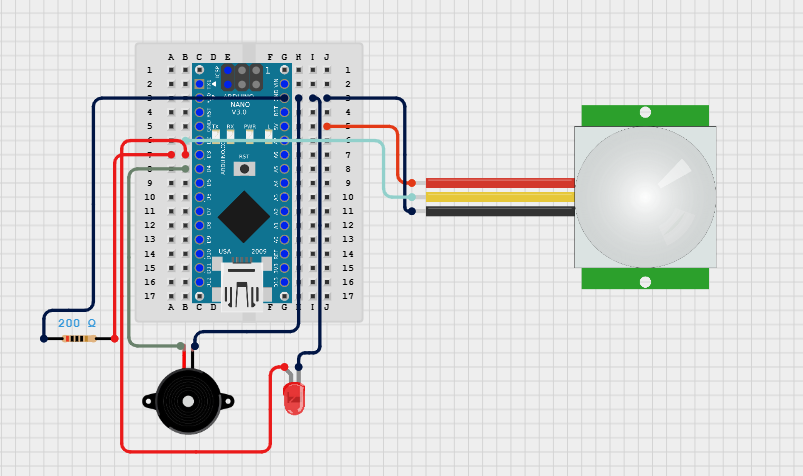

# 🔔 PIR Motion Detection Alarm

This project uses a PIR motion sensor to detect movement and trigger both an LED and a buzzer as an alert system.

---

## 🧰 Components Used

- Arduino board (Uno, Nano, etc.)
- PIR Motion Sensor
- LED
- 200Ω Resistor
- Active Buzzer
- Breadboard
- Jumper wires

---

## 📷 Circuit Diagram

## 🔌 Wiring Guide

| *Component*     | *Arduino Pin* | *Details*                  |
|-------------------|------------------|-------------------------------|
| PIR Sensor VCC    | 5V               | Power                         |
| PIR Sensor GND    | GND              | Ground                        |
| PIR Sensor OUT    | D2               | Motion signal pin             |
| LED Anode (+)     | D3               | Through 220Ω resistor         |
| LED Cathode (–)   | GND              | Connect to Ground             |
| Buzzer (+)        | D4               | Positive terminal             |
| Buzzer (–)        | GND              | Connect to Ground             |

---

## 🔁 Code

cpp
int pirPin = 2;       // PIR sensor output pin
int ledPin = 3;       // LED pin
int buzzerPin = 4;    // Buzzer pin

void setup() {
  pinMode(pirPin, INPUT);
  pinMode(ledPin, OUTPUT);
  pinMode(buzzerPin, OUTPUT);
  Serial.begin(9600);
}

void loop() {
  int motion = digitalRead(pirPin);

  if (motion == HIGH) {
    Serial.println("Motion Detected!");
    digitalWrite(ledPin, HIGH);
    digitalWrite(buzzerPin, HIGH);
    delay(2000); // Alert duration
  } else {
    digitalWrite(ledPin, LOW);
    digitalWrite(buzzerPin, LOW);
  }

  delay(100);
}

---

## 🛠 How It Works

- When motion is detected by the PIR sensor, the LED and buzzer are activated for 2 seconds.
- The Serial Monitor displays a message each time motion is detected.

---

